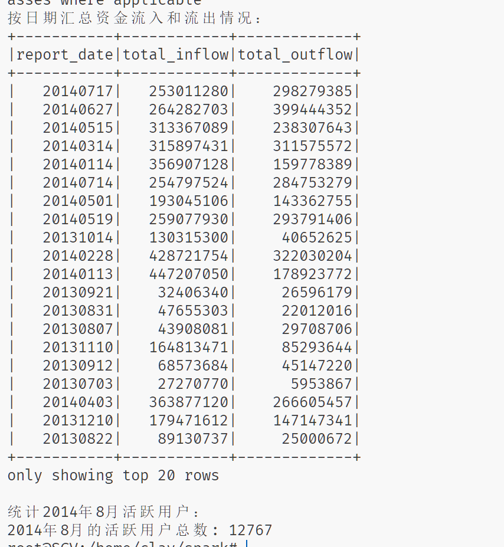
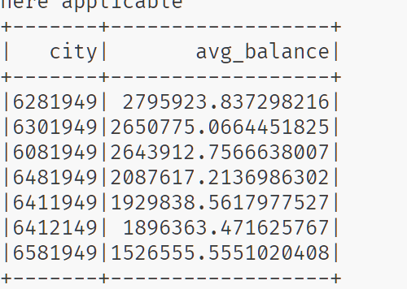
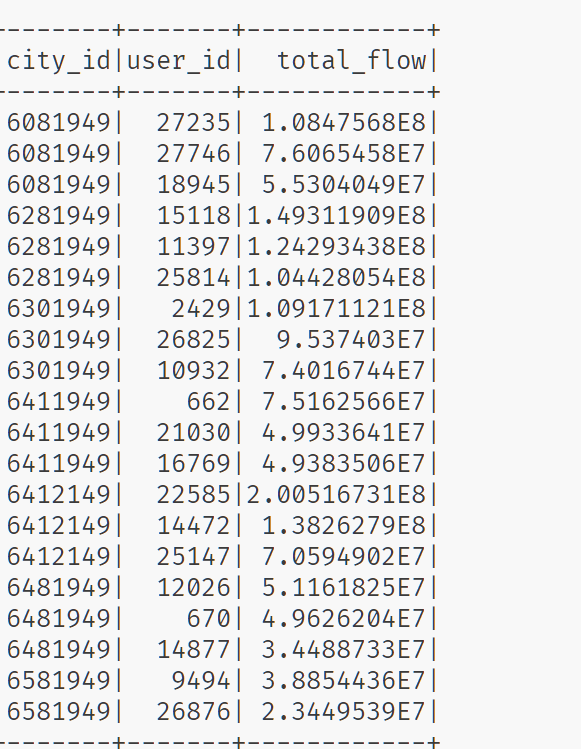
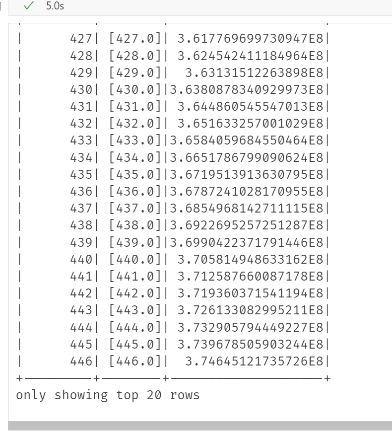
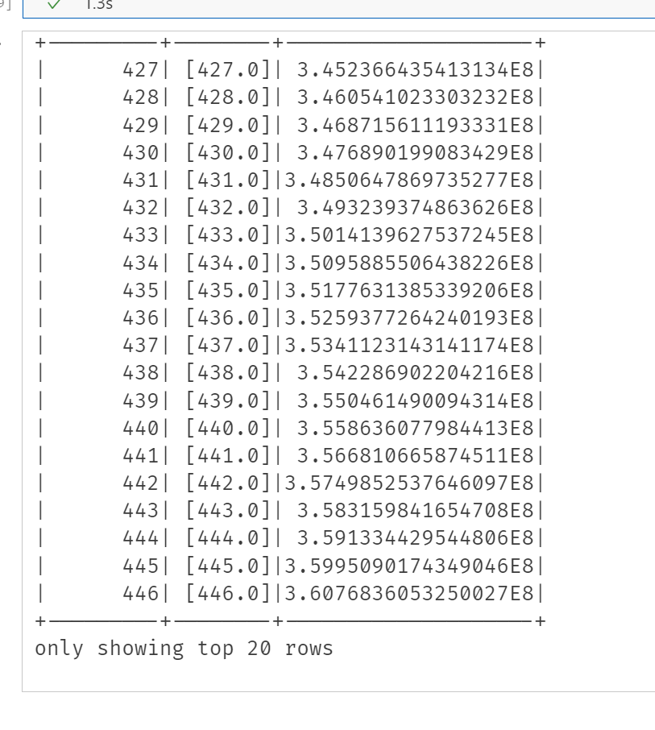

```shell
clay@SCV:~/spark$ tree -L 1
.
├── README.md
├── assets
├── input   # 输入数据，来自https://tianchi.aliyun.com/competition/entrance/231573/information
├── output  # 输出数据
├── task1.py
├── task2.py
└── task3.ipynb
```

# lab4

# 安装spark

放弃使用docker。从官网下载spark后添加环境变量即可使用。

python需要安装pyspark包

```powershell
pip install pyspark
```

# 1： Spark RDD 编程

‍

#### Spark配置与环境初始化

```python
conf = SparkConf().setAppName("FundsFlowAnalysisRDD").set("spark.ui.port", "11451")
sc = SparkContext(conf=conf)
spark = SparkSession.builder.getOrCreate()
```

* 首先，通过 `SparkConf`​ 类创建一个Spark配置对象 `conf`​，设置应用程序的名称为 `"FundsFlowAnalysisRDD"`​，同时显式指定Spark UI所使用的端口为 `"11451"`​，以此避免端口冲突等问题（如果默认端口被占用的话）。
* 接着，利用配置好的 `conf`​ 创建 `SparkContext`​ 对象 `sc`​，它是Spark应用与集群进行交互的主要入口点，用于后续创建RDD、执行各种计算等操作。
* 最后，获取或者创建 `SparkSession`​ 对象 `spark`​，它整合了Spark SQL等功能，方便后续在需要时进行DataFrame相关操作（例如将RDD转换为DataFrame进行展示等情况）。

#### 读取CSV文件并预处理

```python
rdd = sc.textFile("user_balance_table.csv")
header = rdd.first()
header_columns = header.split(",")

required_columns = ['report_date', 'user_id', 'total_purchase_amt', 'total_redeem_amt']
column_indexes = []
for col_name in required_columns:
    try:
        index = header_columns.index(col_name)
        column_indexes.append(index)
    except ValueError:
        print(f"CSV文件中缺少必要的列: {col_name}")
        break
else:
    data_rdd = rdd.filter(lambda line: line!= header).map(lambda line: line.split(","))
```

* 第一步，使用 `sc.textFile`​ 方法读取指定路径（ `"user_balance_table.csv"`​ ）的CSV文件，此时得到的 `rdd`​ 中每一个元素是文件中的一行文本字符串，代表CSV文件中的一行数据记录（但还未进行解析）。
* 第二步，通过 `rdd.first()`​ 获取RDD中的第一行数据，也就是CSV文件的表头行，并将其按逗号分割，存储在 `header_columns`​ 列表中，以便后续通过列名查找对应的列索引位置。
* 第三步，定义了一个包含必要列名的列表 `required_columns`​，然后遍历该列表，在 `header_columns`​ 中查找每个列名对应的索引位置，并将找到的索引添加到 `column_indexes`​ 列表中。如果在查找过程中某个列名不存在（抛出 `ValueError`​ 异常），则打印提示信息并终止后续处理；若所有必要列名都能找到索引，就进入 `else`​ 块。在 `else`​ 块中，使用 `filter`​ 方法过滤掉表头行数据，再通过 `map`​ 方法将剩余的每一行数据按逗号分割成一个个字段列表，得到处理后的数据RDD（ `data_rdd`​ ），方便后续基于字段进行操作。

#### 任务1：按日期计算资金流入和流出

```python
print("按日期汇总资金流入和流出情况：")
date_amount_rdd = data_rdd.map(lambda fields: (fields[column_indexes[0]], (float(fields[column_indexes[1]]), float(fields[column_indexes[2]]))))
daily_inflow_outflow_rdd = date_amount_rdd.reduceByKey(lambda x, y: (x[0] + y[0], x[1] + y[1]))
daily_inflow_outflow_df = spark.createDataFrame(daily_inflow_outflow_rdd.map(lambda x: (x[0], x[1][0], x[1][1])), ["report_date", "total_inflow", "total_outflow"])
daily_inflow_outflow_df.show()
```

* 使用 `map`​ 操作从 `data_rdd`​ 中提取数据，以日期字段（通过之前获取的列索引 `column_indexes[0]`​ 定位）作为键，将买入金额（ `total_purchase_amt`​ ，通过 `column_indexes[1]`​ 定位并转换为浮点数）和赎回金额（ `total_redeem_amt`​ ，通过 `column_indexes[2]`​ 定位并转换为浮点数）组成的元组作为值，构建成一个新的键值对形式的RDD（ `date_amount_rdd`​ ）。
* 通过 `reduceByKey`​ 操作按照日期（键）进行分组，并对每个日期对应的买入金额和赎回金额分别进行求和聚合，得到按日期汇总后的资金流入和流出情况的键值对RDD（ `daily_inflow_outflow_rdd`​ ）。
* 为了方便展示结果，将 `daily_inflow_outflow_rdd`​ 进行转换，先通过 `map`​ 操作将其键值对中的元素整理成符合DataFrame列要求的形式（包含日期、资金流入、资金流出三个字段），再利用 `spark.createDataFrame`​ 方法将其转换为DataFrame（ `daily_inflow_outflow_df`​ ），并调用 `show`​ 方法将结果展示出来。
* 结果保存在`task1.in_out_daily`​中

#### 任务2：统计2014年8月的活跃用户

```python
print("统计2014年8月活跃用户：")
august_data_rdd = data_rdd.filter(lambda fields: fields[column_indexes[0]].startswith('201408'))
user_date_rdd = august_data_rdd.map(lambda fields: (fields[column_indexes[1]], fields[column_indexes[0]]))
user_active_days_rdd = user_date_rdd.groupByKey().mapValues(lambda dates: len(set(dates)))
active_users_count = user_active_days_rdd.filter(lambda x: x[1] >= 5).count()
print(f"2014年8月的活跃用户总数: {active_users_count}")
```

* 使用 `filter`​ 方法从 `data_rdd`​ 中筛选出日期字段（通过 `column_indexes[0]`​ 定位）以 `"201408"`​ 开头的数据行，得到只包含2014年8月数据的RDD（ `august_data_rdd`​ ）。
* 通过 `map`​ 操作将 `august_data_rdd`​ 中的数据行转换为以用户ID（通过 `column_indexes[1]`​ 定位）为键，日期为值的键值对形式的RDD（ `user_date_rdd`​ ），方便后续按用户ID进行分组统计。
* 使用 `groupByKey`​ 操作按照用户ID进行分组，对于每个用户ID对应的一组日期值，通过 `mapValues`​ 操作计算这组日期中不同日期的数量（也就是活跃天数），得到以用户ID为键，活跃天数为值的新的键值对RDD（ `user_active_days_rdd`​ ）。
* 通过 `filter`​ 操作筛选出活跃天数大于等于5的用户对应的键值对，并使用 `count`​ 方法统计这样的用户数量，将统计结果存储在 `active_users_count`​ 变量中，同时打印出相应的提示信息，展示2014年8月的活跃用户总数。

​​

# 2：Spark SQL 编程

将两张表通过user_id合并为user_balance

```python
# # 将 user_profile 表的信息合并到 user_balance 表中
user_balance_with_city_df = user_balance_df.join(user_profile_df, on="user_id", how="left")
# # 注册表
user_balance_with_city_df.createOrReplaceTempView("user_balance")
```

#### 1 、计算每个城市在 2014 年 3 ⽉ 1 ⽇的⽤户平均余额 ( tBalance ) ，按平均余额降序排列。

编写sql语句完成任务

```sql
SELECT
    city,
    AVG(CAST(tBalance AS DOUBLE)) AS avg_balance
FROM
    user_balance
WHERE
    report_date = '20140301'
GROUP BY
    city
ORDER BY
    avg_balance DESC
```

结果保存至`task2.1_avg_balance.csv`​

​​

#### 2 、统计每个城市总流量前 3 ⾼的⽤户：

统计每个城市中每个⽤户在 2014 年 8 ⽉的总流量（定义为 total\_purchase\_amt + total\_redeem\_amt  ），并输出每个城市总流量排名前三的⽤户 ID 及其 总流量。

```sql
-- 2. 统计每个城市总流量前3高的用户
SELECT city_id, user_id, total_flow
FROM (
    SELECT 
        up.City AS city_id, 
        ub.user_id, 
        SUM(ub.total_purchase_amt + ub.total_redeem_amt) AS total_flow,
        RANK() OVER (PARTITION BY up.City ORDER BY SUM(ub.total_purchase_amt + ub.total_redeem_amt) DESC) AS ranking
    FROM 
        user_profile_table up
    JOIN 
        user_balance_table ub 
    ON 
        up.user_id = ub.user_id
    WHERE 
        SUBSTR(ub.report_date, 1, 6) = '201408'
    GROUP BY 
        up.City, ub.user_id
) AS ranked_users
WHERE ranking <= 3;
```

结果保存至`task2.2_top3_users.csv`​

​​

# 3： Spark ML 编程

在这个任务中，我们需要使用2013-07-01~2014-08-31的数据，预测2014-09的收支信息。

这个任务用到的数据是task1得到的结果，即每日总流入/流出。从csv文件读取数据

```py
# 创建SparkSession
spark = SparkSession.builder \
    .appName("Linear Regression Forecast") \
    .getOrCreate()

# 1. 从CSV文件加载数据
file_path = "output/task1.in_out_daily/part-00000-f000be85-9759-4374-bdda-566c8ba19423-c000.csv"  
data = spark.read.csv(file_path, header=True, inferSchema=True)

```

将日期一列转换为更适合ml任务的数值型数据,选择以2013-07-01作为基准时间, 日期用相对这一天的偏移量表示

```py
# 2. 提取report_date和total_purchase_amt
# 将report_date转换为数值型，相对于基础日期2013-07-01的偏移天数
base_date = "2013-07-01"
data = data.withColumn("report_date", to_date(col("report_date"), 'yyyyMMdd'))
data = data.withColumn("day_index", datediff(col("report_date"), lit(base_date)))
data.show()
purchase_df = data.select("day_index", "total_purchase_amt").orderBy("day_index")
redeem_df = data.select("day_index", "total_redeem_amt").orderBy("day_index")
def preprocess_data(df, index_col, value_col):
    assembler = VectorAssembler(inputCols=index_col, outputCol="features")
    df = assembler.transform(df).select("features", col(value_col).alias("label"))
    return df
processed_purchase_df = preprocess_data(purchase_df, ["day_index"], "total_purchase_amt")
processed_redeem_df = preprocess_data(redeem_df, ["day_index"], "total_redeem_amt")
```

使用ml模型对数据进行拟合,这里选取pyspark.ML内建的线性回归模型.

```py
lr = LinearRegression(featuresCol="features", labelCol="label", maxIter=10, regParam=0.3, elasticNetParam=0.8)
model1 = lr.fit(processed_purchase_df)
# 5. 预测未来30天
def predict_future(model, start_index, num_days):
    future_data = [(start_index + i,) for i in range(1, num_days + 1)]
    future_df = spark.createDataFrame(future_data, ["day_index"])
    assembler = VectorAssembler(inputCols=["day_index"], outputCol="features")
    future_df = assembler.transform(future_df)
    predictions = model.transform(future_df)
    return predictions

last_day_index = purchase_df.selectExpr("max(day_index) as day_index").collect()[0]["day_index"]
purchase_predictions = predict_future(model1, last_day_index, 30)
# 显示预测结果
purchase_predictions.show()

lr=LinearRegression(featuresCol="features",labelCol="label")
model2=lr.fit(processed_redeem_df)
redeem_predictions=predict_future(model2,last_day_index,30)
redeem_predictions.show()
```

​​

​​

将预测结果保存到csv文件

```py
from pyspark.sql.functions import col, expr, date_format
result1=purchase_predictions.select(
    col("day_index"),
    col("prediction")
)
result2=redeem_predictions.select(
    col("day_index"),
    col("prediction").alias("prediction2")
)
df=result1.join(result2,on=["day_index"],how="inner")
# 将base_date转换为日期类型

# 计算新的日期列
df_with_date = df.withColumn(
    "date",
    date_format(
        expr(f"date_add(to_date('{base_date}'), cast(day_index as INT))"),
        "yyyyMMdd"
    )
)
result=df_with_date.select(
    col("date").alias('report_date'), 
    col("prediction").alias('total_purchase_amt'),
    col("prediction2").alias('total_redeem_amt')
    )
#转换成整数
result=result.withColumn("total_purchase_amt",result["total_purchase_amt"].cast("int"))
result=result.withColumn("total_redeem_amt",result["total_redeem_amt"].cast("int"))

result.coalesce(1).write.csv("output/task3.result", header=False, mode="overwrite")
```

‍
